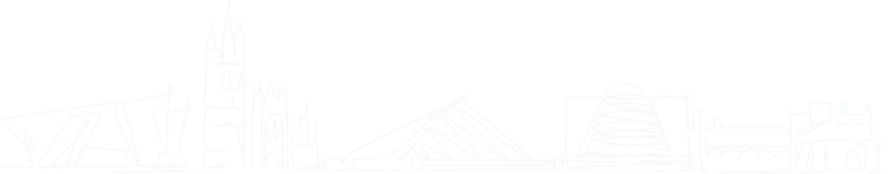

Hey - I'm Ash and I'm passionate about solving problems and building things.

In that spirit, I want to create software that feels light and intuitive, and that brings joy to the people who use it(however small).

In the past, I was 
* a Student at [UCD](https://www.ucd.ie),
* President of [Netsoc](https://www.netsoc.com) - UCD's Computer Science Society, 
* an intern at [Bloomberg](https://www.bloomberg.com), [Stripe](https://stripe.com) and [Toast](https://pos.toasttab.com/).

These days I'm a Software Engineer at [Stripe](https://stripe.com), on the Secure Frameworks team where I'm learning, exploring, and building all things Web Security.

Outside of work I find pleasure in baking, reading, walking, and travelling whenever possible.

At some point, I'd like to get into research and academia, but for now I'm happy to be working on interesting problems with great people. (That being said, if you have any interesting research ideas, or projects, I'd love to hear them!)

I'll try to write more often about my experiences but until then, I'm always happy to chat!

Feel free to reach out on [contact@ash.xyz](email:contact@ash.xyz)

```go
func main() {
	fmt.Println("Hey there, looks like you made it through my yapping.",
		"Thanks! 👊🏾")
}
```